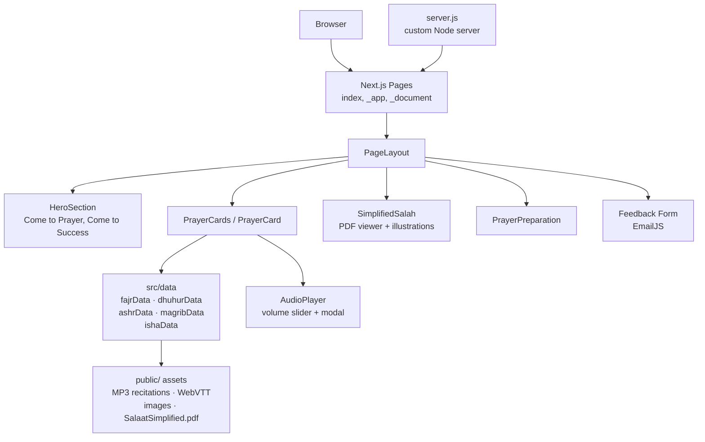

<p align="center">
  
</p>

<p align="center">
  
  
  
  
  
</p>

> **Developed by [Arslan Malik](https://github.com/arsalanmaalik461)**
> 📱 WhatsApp: [+92 300 8987448](https://wa.me/923008987448) · 🌐 Website: [arslanmalik.tech](https://arslanmalik.tech)

# 🕌 Start2Pray — Learn Salah Step by Step

> *"Come to Prayer, Come to Success"* — made in Oman 🇴🇲

---

## 🌟 Executive Overview

**Start2Pray** (start2pray.com) is an interactive Islamic learning platform that teaches the Muslim prayer (Salah) step by step. Built with **Next.js 12**, **React 17** and **TypeScript**, it was created for the **Islamic Information Center, Sultan Qaboos Grand Mosque, Muscat** — helping new Muslims and anyone learning to pray follow along with guided, movement-synchronized recitations.

Every one of the five daily prayers — **Fajr, Dhuhr, Asr, Maghrib and Isha** — is presented as an interactive card backed by real guided audio. Each rakah is annotated with WebVTT caption files and precise `movementTime` data (standing → bowing → prostration → sitting), so the on-screen illustration moves in sync with the recitation. A built-in audio player with volume control, a modal prayer player, an embedded *Salaat Simplified* PDF booklet, a prayer-preparation guide and a feedback form round out the experience — all styled with Tailwind CSS.

---

## 📑 Table of Contents

- [✨ Key Features & Highlights](#-key-features--highlights)
- [🖥️ Feature Showcase](#️-feature-showcase)
- [🏗️ System Architecture](#️-system-architecture)
- [🚀 Quickstart & Installation Guide](#-quickstart--installation-guide)
- [📂 Project Structure](#-project-structure)
- [🛡️ Security & Notes](#️-security--notes)

---

## ✨ Key Features & Highlights

| Feature | Description |
| :--- | :--- |
| 🕌 **Five daily prayers** | Interactive prayer cards for **Fajr, Dhuhr, Asr, Maghrib and Isha**, each backed by its own dataset (`fajrData`, `dhuhurData`, `ashrData`, `magribData`, `ishaData`) |
| 🔊 **Movement-synced guided audio** | Per-rakah MP3 recitations paired with WebVTT captions and `movementTime` annotations, so prayer illustrations move in sync with the recitation (standing, bowing, prostration, sitting) |
| 🎛️ **Audio player** | Custom audio player with volume slider, modal player cards and play/pause controls |
| 📖 **Simplified Salah booklet** | Embedded *Salaat Simplified* PDF viewer (`SalaatSimplified.pdf`) plus an illustrated step-by-step prayer component |
| 🧭 **Prayer preparation guide** | Dedicated section guiding users through the steps before prayer |
| ✉️ **Feedback form** | Contact/feedback form wired to **EmailJS** for direct email delivery |
| 🎨 **Polished UI** | Tailwind CSS styling with modals (Headless UI, Radix), carousels and icons throughout |
| ⚙️ **Custom production server** | `server.js` Node server for serving the production build |

---

## 🖥️ Feature Showcase

### 1. Guided Prayer Cards — Five Prayers, Step by Step

> *"Learn each prayer the way it is performed — hear it, see it, follow it."*

- One interactive card per prayer: **Fajr, Dhuhr, Asr, Maghrib, Isha**
- Every rakah carries its own recording (`/audio/<prayer>/<prayer>-rakaa-N.mp3`)
- WebVTT caption files (`*.vtt`) keep the recitation text on screen
- `movementTime` arrays drive the posture illustrations: standing → bowing → standing → prostration → sitting

### 2. Audio Player with Volume Control

> *"Listen, pause, and control every recitation."*

- Custom `AudioPlayer` component with a dedicated `volumeSlider`
- Modal player cards (`playerModal`, `playerCard`) for an immersive listening view
- React Player under the hood with styled controls

### 3. Simplified Salah Booklet & Prayer Preparation

> *"The whole prayer, illustrated and downloadable-style."*

- Embedded iframe viewer for `SalaatSimplified.pdf`
- Step-by-step illustrated prayer component (`PrayerComponent`)
- Separate prayer-preparation section explaining what comes before the Salah

---

## 🏗️ System Architecture



---

## 🚀 Quickstart & Installation Guide

### Prerequisites

- **Node.js** 14+ (16 recommended) and **npm** or **yarn**
- Git

> ⚠️ The repo stores source and assets as zip archives — unzip them first (see structure below).

### Step-by-Step Installation

```bash
# 1. Clone the repo
git clone https://github.com/arsalanmaalik461/pray-web.git
cd pray-web

# 2. Unzip the source, pages and public assets
unzip src.zip -d src
unzip pages.zip -d pages
unzip styles.zip -d styles
unzip public.zip -d public            # split archive: public.z01–z04 + public.zip

# 3. Install dependencies
npm install

# 4. Run the dev server
npm run dev
# open http://localhost:3000

# 5. Production build & serve (custom server.js)
npm run build
npm start   # NODE_ENV=production node server.js
```

---

## 📂 Project Structure

```
pray-web/
├── pages/                 # Next.js routes (shipped as pages.zip → unzip first)
│   ├── index.tsx          # Home page
│   ├── _app.tsx           # App wrapper
│   └── _document.tsx      # Document shell
├── src/                   # Components & data (shipped as src.zip → unzip first)
│   ├── components/
│   │   ├── heroSection/       # "Come to Prayer Come to Success" hero
│   │   ├── prayerCard/        # PrayerCards + PrayerCard
│   │   ├── prayer/            # Step-by-step illustrated prayer + images
│   │   ├── audioplayer/       # AudioPlayer, volumeSlider, player modals/cards
│   │   ├── simplifiedSalah/   # Salaat Simplified PDF viewer
│   │   ├── prayerPrepration/  # Prayer preparation guide
│   │   ├── feedback/          # EmailJS feedback form
│   │   ├── introduction/      # Intro section
│   │   ├── about/             # About — Islamic Info Center, SQ Grand Mosque
│   │   ├── header/  footer/   # Site chrome
│   │   ├── modal/  slider/    # UI primitives
│   │   └── volumeSlider/
│   ├── data/              # Per-prayer datasets
│   │   ├── prayerRecords.ts   # fajr + dhuhur + ashr + magrib + isha
│   │   ├── fajrData.ts  dhuhurData.ts  ashrData.ts
│   │   ├── magribData.ts  ishaData.ts  type.ts
│   └── layouts/           # PageLayout
├── public/                # Audio (MP3), WebVTT, images, PDFs
│                          # (shipped as public.zip + public.z01–z04 → unzip first)
├── styles/                # Global styles (shipped as styles.zip → unzip first)
├── server.js              # Custom Node production server
├── next.config.js  tailwind.config.js  postcss.config.js
├── tsconfig.json  next-env.d.ts
└── package.json           # next 12.1.0 · react 17.0.2 · typescript 4.6.2
```

---

## 🛡️ Security & Notes

- The **EmailJS service/template/user keys** in the feedback form are demo keys committed to the repo — replace them with your own keys from [emailjs.com](https://www.emailjs.com) before deploying.
- The `public/` assets (audio, images, PDFs) are large (~95 MB) and shipped as split zip archives — keep them out of further commits; use Git LFS if the media changes often.
- Content (recitations, illustrations, booklet) is educational religious material prepared for the Islamic Information Center, Sultan Qaboos Grand Mosque, Muscat — verify suitability before reusing in other contexts.

---

<p align="center">
  <sub>Developed with ❤️ by <a href="https://github.com/arsalanmaalik461">Arslan Malik</a> · 📱 <a href="https://wa.me/923008987448">WhatsApp: +92 300 8987448</a> · 🌐 <a href="https://arslanmalik.tech">arslanmalik.tech</a></sub>
</p>
<!-- refreshed: 2026-10-03 -->
